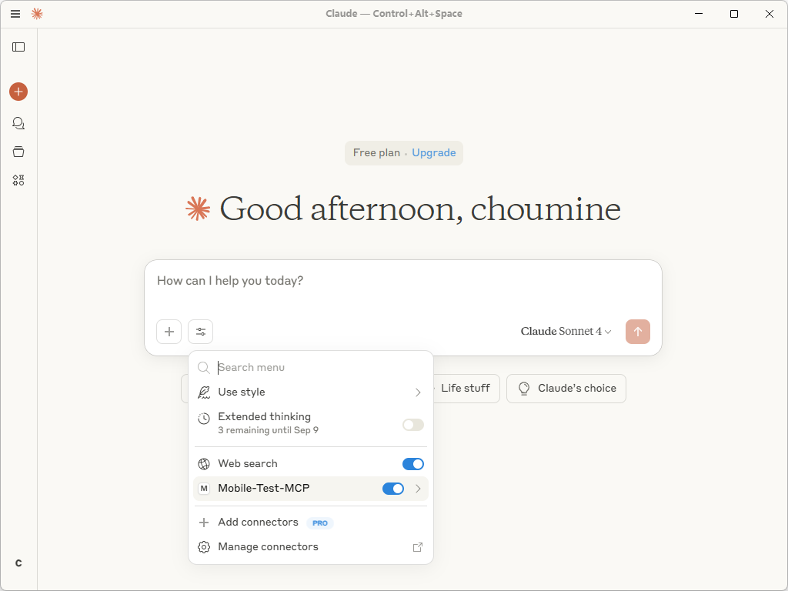
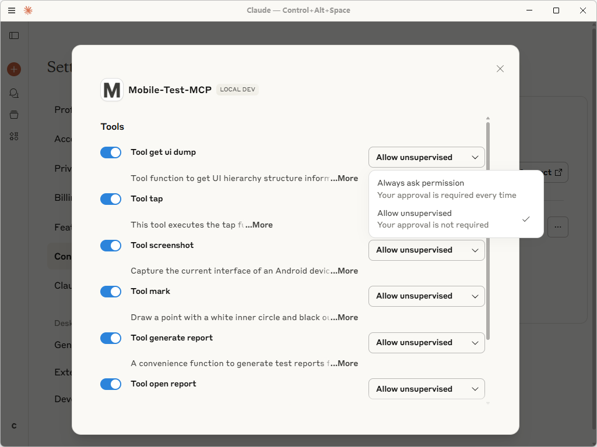

# **Mobile Test MCP: An LLM-Powered UI Test Automation Framework for Android**

## **Overview**

**Mobile Test MCP** transforms Android UI testing by empowering Large Language Models (LLMs) to interact with and control physical devices directly. Our framework interprets test cases written in natural language, seamlessly executes the corresponding actions, validates outcomes on the fly, and generates comprehensive test reports. Move beyond complex scripts and start testing at the speed of conversation.

-----

## **Key Features**

🧠 **Model-Agnostic LLM Integration**
Leverage MCP technology for a unified interface that allows plug-and-play integration with any LLM (e.g., Claude, Gemini, Qwen). This ensures maximum flexibility and future-proofs your testing.

🔌 **Zero-Dependency Native ADB Control**
We've used the Android Debug Bridge (ADB) protocol natively, reducing third-party dependencies. This guarantees robust performance, maximum compatibility, and precise, low-level device control you can rely on.

📊 **Insightful, Automated Reporting**
Automatically generate detailed HTML reports for every test run. Each report provides a clear, actionable analysis by documenting the complete execution workflow, verifying assertion outcomes, and including visual evidence like screenshots.

-----

## **Demo**


-----

## **🚀 Getting Started**

### **Prerequisites**

Before you begin, please ensure:

  * An Android physical device or emulator is connected and recognized by ADB.
  * Your device is in a ready state (visible in the `adb devices` list).
  * The device screen is awake and on the default home screen.
  * `uv` is installed and configured. See [uv Installation Guide](https://github.com/astral-sh/uv?tab=readme-ov-file#installation).

### **Setup with Claude Desktop**

You can get started by either cloning the repository or installing directly from PyPI.

#### **Option A: Clone the Repository**

**1. 📂 Clone the Repository**

```bash
git clone https://git.code.tencent.com/choumine/Mobile-Test-MCP.git "your_clone_path"
# Example: git clone ... "D:\\Mobile-Test-MCP"
```

**2. 📝 Configure the MCP Server**
Edit your `claude_desktop_config.json` file with the following configuration, replacing `"your_clone_path"` with the actual path.

```json
{
  "mcpServers": {
    "Mobile-Test-MCP": {
      "command": "uv",
      "args": [
        "--directory",
        "your_clone_path", // Example: "D:\\Mobile-Test-MCP"
        "run",
        "Mobile-Test-MCP"
      ]
    }
  }
}
```

#### **Option B: PyPI Installation**

**1. 📝 Configure the MCP Server**
For a cleaner setup, install the package from PyPI and edit `claude_desktop_config.json` with this configuration:

```json
{
  "mcpServers": {
    "Mobile-Test-MCP": {
      "type": "stdio",
      "command": "uvx",
      "args": [
        "mobile-test-mcp"
      ]
    }
  }
}
```

#### **Final Steps**

**3. 🔄 Restart Claude Desktop**
Close and reopen the Claude Desktop application to apply the new settings.



**4. ✅ Set Permissions**
Navigate to **Settings \> Connectors** and set the tool permissions for **Mobile-Test-MCP** to **"Allow Unsupervised"** for the best and smoothest experience.



-----

## **✍️ Usage Example**

Writing a test case is as simple as describing the steps.

> **Test Case: Verify Device IMEI**
>
> 1.  Start the test.
> 2.  Open the device's dial pad.
> 3.  Enter the USSD code by pressing the keys: \*, \#, 0, 6, \#.
> 4.  Observe the screen to confirm that IMEI1 and IMEI2 are displayed.
> 5.  Verify that the length of IMEI1 is exactly 15 digits.
> 6.  Verify that the length of IMEI2 is also 15 digits.

-----

## **🛠️ Technical Architecture**

The core logic is modularly organized to handle specific automation tasks.

```python
src/mobile_test_mcp/
├── tool_execute_test.py    # Test execution core module
├── tool_get_ui_dump.py     # UI element parser
├── tool_screenshot.py      # Screen capture service
├── tool_mark.py            # Screenshot annotation processor
├── tool_tap.py             # Simulates user tap actions
├── tool_generate_report.py # HTML report generation engine
└── tool_open_report.py     # Launches the generated test report
```

-----
## **⚙️ Technology Stack & Project Info**

| Category           | Details                                                                              |
| ------------------ | ------------------------------------------------------------------------------------ |
| **Code Version** | `v0.1.0`                                                                             |
| **Repository** | [Tencent Code Repository](https://git.code.tencent.com/choumine/Mobile-Test-MCP)     |
| **PyPI Package** | [https://pypi.org/project/mobile-test-mcp/](https://pypi.org/project/mobile-test-mcp/) |
| **License** | `MIT License`                                                                        |
| **Version Control**| `Git`                                                                                |
| **Languages** | `Python`, `HTML`, `CSS`                                                              |
| **Dependencies** | `Python 3.10+`, `MCP`, `Pillow`                                                      |
| **Documentation** | [README.md](https://git.code.tencent.com/choumine/Mobile-Test-MCP/blob/master/README.md) |
| **Support Contact**| `2413593045@st.gxu.edu.cn`                                                           |
