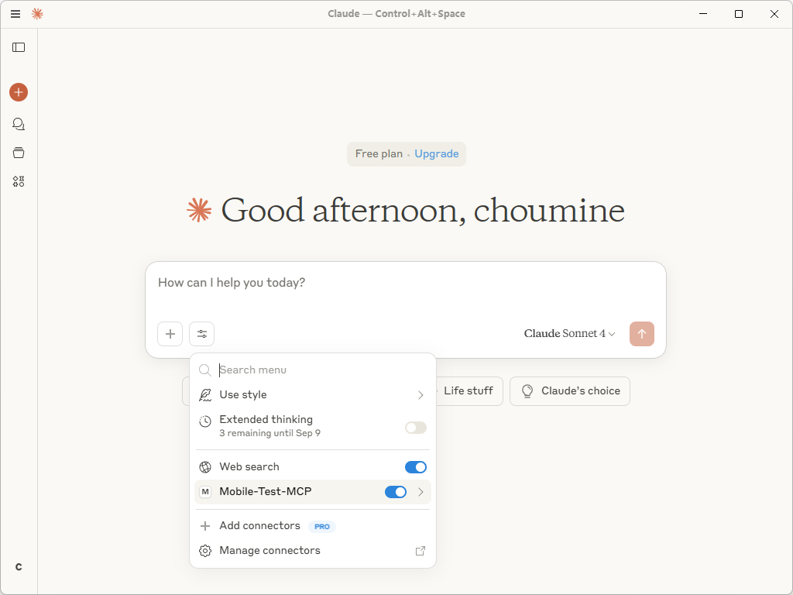
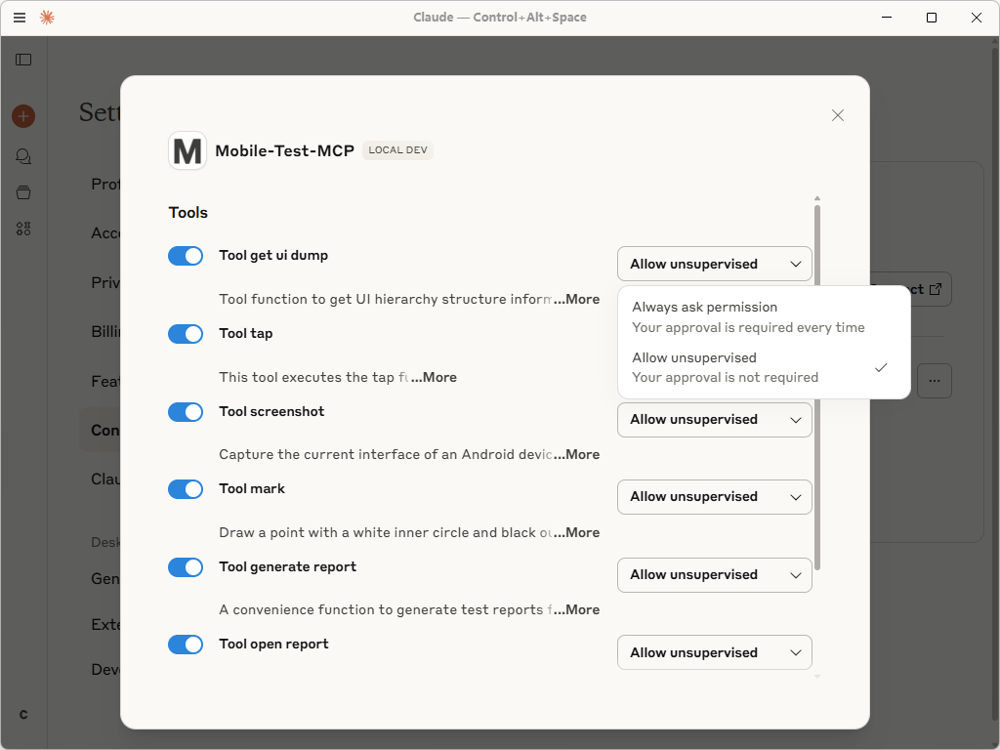

# **Mobile Test MCP：一个面向安卓的LLM驱动的UI测试自动化框架**

## **概述**

**Mobile Test MCP** 通过赋予大语言模型（LLMs）直接与实体设备交互和控制的能力，改变安卓UI测试。我们的框架能够解释用自然语言编写的测试用例，无缝地执行相应的操作，即时验证结果，并生成全面的测试报告。告别复杂的脚本，开始以对话的速度进行测试。

-----

## **主要功能**

🧠 **模型无关的LLM集成**
利用MCP技术，实现了一个统一的接口，可以即插即用地集成任何LLM（例如：Claude、Gemini、Qwen）。这确保了最大的灵活性，并使你的测试面向未来。

🔌 **零依赖的原生ADB控制**
我们使用了原生安卓调试桥（ADB）协议，减少了第三方依赖。这保证了可靠的性能、最大的兼容性，以及你可以信赖的精确、底层的设备控制。

📊 **富有洞察力的自动化报告**
为每次测试运行自动生成详细的HTML报告。每份报告都通过记录完整的执行工作流、验证断言结果和包含截图等视觉证据，提供清晰、可操作的分析。

-----

## **演示**


-----

## **🚀 开始使用**

### **先决条件**

在开始之前，请确保：

  * 已连接一个安卓实体设备或模拟器，并能被ADB识别。
  * 你的设备处于准备就绪状态（在 `adb devices` 列表中可见）。
  * 设备屏幕已唤醒并停留在默认主屏幕。
  * `uv` 已安装和配置。请参阅 [uv安装指南](https://github.com/astral-sh/uv?tab=readme-ov-file#installation)。

### **使用Claude桌面版进行设置**

你可以通过克隆代码库或直接从PyPI安装来开始。

#### **选项A：克隆代码库**

**1. 📂 克隆代码库**

```bash
git clone https://github.com/choumine/Mobile-Test-MCP.git "你的克隆路径"
# 示例：git clone ... "D:\\Mobile-Test-MCP"
```

**2. 📝 配置MCP服务器**
编辑你的 `claude_desktop_config.json` 文件，进行如下配置，将 `"你的克隆路径"` 替换为实际路径。

```json
{
  "mcpServers": {
    "Mobile-Test-MCP": {
      "command": "uv",
      "args": [
        "--directory",
        "你的克隆路径", // 示例: "D:\\Mobile-Test-MCP"
        "run",
        "Mobile-Test-MCP"
      ]
    }
  }
}
```

#### **选项B：PyPI安装**

**1. 📝 配置MCP服务器**
为了更简洁的设置，从PyPI安装包并编辑 `claude_desktop_config.json`，进行如下配置：

```json
{
  "mcpServers": {
    "Mobile-Test-MCP": {
      "type": "stdio",
      "command": "uvx",
      "args": [
        "mobile-test-mcp"
      ]
    }
  }
}
```

#### **最后步骤**

**3. 🔄 重启Claude桌面版**
关闭并重新打开Claude桌面版应用程序以应用新设置。



**4. ✅ 设置权限**
导航至 **Settings \> Connectors**（设置 \> 连接器），将 **Mobile-Test-MCP** 的工具权限设置为 **"Allow Unsupervised"**（允许无监督），以获得最佳和最流畅的体验。



-----

## **✍️ 使用示例**

编写测试用例就像描述步骤一样简单。

> **测试用例：验证设备IMEI**
>
> 1.   开始测试。
> 2.   打开设备的拨号键盘。
> 3.   按键输入USSD码：\*、\#、0、6、\#。
> 4.   观察屏幕，确认IMEI1和IMEI2已显示。
> 5.   验证IMEI1的长度正好是15位数字。
> 6.   验证IMEI2的长度也是15位数字。

-----

## **🛠️ 技术架构**

核心逻辑被模块化组织，以处理特定的自动化任务。

```python
src/mobile_test_mcp/
├── tool_execute_test.py    # 测试执行核心模块
├── tool_get_ui_dump.py     # UI元素解析器
├── tool_screenshot.py      # 屏幕截图服务
├── tool_mark.py            # 截图注释处理器
├── tool_tap.py             # 模拟用户点击操作
├── tool_generate_report.py # HTML报告生成引擎
└── tool_open_report.py     # 启动生成的测试报告
```

-----

## **⚙️ 技术栈与项目信息**

| 类别             | 详细信息                                                                               |
| ------------------ | ------------------------------------------------------------------------------------ |
| **代码版本** | `v0.1.0`                                                                             |
| **代码库** | [https://github.com/choumine/Mobile-Test-MCP](https://github.com/choumine/Mobile-Test-MCP)     |
| **PyPI包** | [https://pypi.org/project/mobile-test-mcp/](https://pypi.org/project/mobile-test-mcp/) |
| **许可证** | `MIT`                                                                        |
| **版本控制**| `Git`                                                                                |
| **语言** | `Python`, `HTML`, `CSS`                                                              |
| **依赖项** | `Python 3.10+`, `MCP`, `Pillow`                                                      |
| **文档** | [https://github.com/choumine/Mobile-Test-MCP/blob/main/README.md](https://github.com/choumine/Mobile-Test-MCP/blob/main/README.md) |
| **支持联系**| `2413593045@st.gxu.edu.cn`                                                           |
